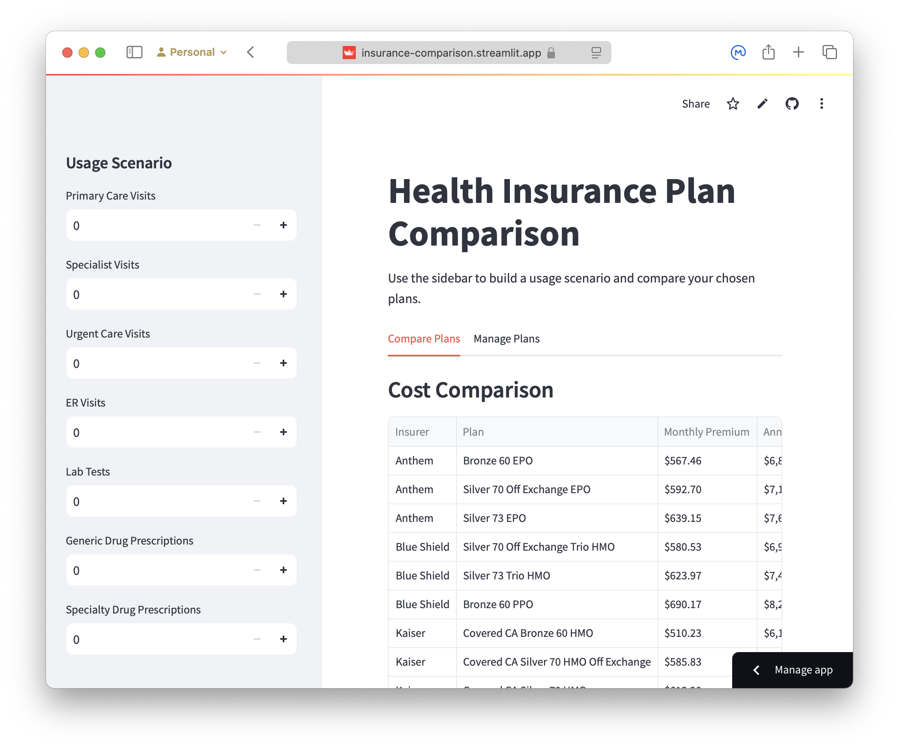

# Health Insurance Plan Comparison Calculator

A tool to compare health insurance plans and estimate annual costs based on expected medical usage. Try it at [insurance-comparison.streamlit.app](https://insurance-comparison.streamlit.app) or run it locally with your own plan data.

The hosted app compares a set of low- and medium-cost plans available in the California ACA marketplace for plan year 2025. To use your own plans, see the instructions below.

> [!IMPORTANT]
> I am not a health care professional, and this app may have bugs! Please double-check plan information and results before making health care decisions.



## Features

- Compare multiple insurance plans side-by-side
- Calculate estimated annual costs based on expected medical usage
- Visualize how costs scale with medical expenses
- Model emergency scenarios
- Add and manage your own insurance plans

## Running Locally

1. Clone this repository
2. Use Poetry to install dependencies: `poetry install`
3. Modify the `plans.json` file as needed to add or remove plans
4. Run the app: `poetry run streamlit run app.py`

## Using the Calculator

1. **Add Plans**: Use the "Manage Plans" tab to add plans manually, or modify `plans.json` with your plan details.

2. **Enter Usage**: In the sidebar, enter your expected medical service usage:
   - Number of primary care visits
   - Number of specialist visits
   - Number of urgent care visits
   - Number of ER visits
   - Number of lab tests
   - Number of generic prescriptions
   - Number of specialty prescriptions

3. **Model Emergencies**: Toggle "Add Emergency Scenario" to model costs for a serious medical event, including:
   - Ambulance transport
   - Emergency room visit
   - Hospital stay (adjustable length)
   - Follow-up care

4. **Compare Plans**: View side-by-side comparisons of:
   - Monthly and annual premiums
   - Estimated out-of-pocket costs
   - Total annual costs
   - Cost breakdown by service
   - Cost scaling visualization

## Plans.json Schema

You can add or modify the `plans.json` file in the same directory as `app.py`.

> [!TIP]
> Use [**this custom GPT**](https://chatgpt.com/g/g-67607e0805c08191bdd10ae2194d9e8f-insurance-plan-jsonifier) to convert a [Summary of Benefits and Coverage](https://www.healthcare.gov/glossary/summary-of-benefits-and-coverage/) pdf into a json object you can paste straight into `plans.json`.

The `plans.json` file uses this structure:

```json
{
  "plans": [
    {
      "plan_name": "String",
      "plan_type": "String (HMO|PPO|EPO)",
      "insurer": "String",
      "premium": "Number (monthly premium)",
      "deductibles": {
        "overall": "Number",
        "family": "Number (optional)"
      },
      "out_of_pocket_limit": {
        "individual": "Number",
        "family": "Number (optional)"
      },
      "referral_needed": "Boolean",
      "services_covered_before_deductible": [
        "String (service names)"
      ],
      "cost_sharing": {
        "primary_care": {
          "in_network": {
            "copay": "Number (optional)",
            "coinsurance": "Number (optional, percentage as decimal)"
          },
          "out_of_network": {
            "coverage": "String|Number",
            "covered_as_in_network": "Boolean (optional)"
          }
        },
        "specialist": { "Same structure as primary_care" },
        "urgent_care": { "Same structure as primary_care" },
        "emergency_room": {
          "care": { "Same structure as primary_care" },
          "transportation": { "Same structure as primary_care" }
        },
        "diagnostic_test": {
          "lab": { "Same structure as primary_care" }
        },
        "prescription_drugs": {
          "tier_1": {
            "in_network": {
              "retail_copay": "Number",
              "home_delivery_copay": "Number"
            }
          },
          "tier_4": {
            "in_network": {
              "retail_coinsurance": "Number (percentage as decimal)",
              "retail_max": "Number"
            }
          }
        },
        "hospital_stay": {
          "facility_fee": { "Same structure as primary_care" }
        }
      }
    }
  ]
}
```

## Calculator Assumptions

The calculator makes several assumptions to model health insurance costs:

### Base Service Costs
Uses standardized costs for services before insurance:
- Primary Care Visit: $150
- Specialist Visit: $250
- Urgent Care Visit: $200
- Emergency Room Visit: $1,000
- Lab Work: $300
- Generic Drugs: $30/prescription
- Specialty Drugs: $600/prescription
- Ambulance: $1,200
- Hospital Stay: $2,500/day

### Cost Scaling Model
For the cost curve analysis, medical expenses are distributed across services based on total cost:
- Low costs (<$1,000): 60% primary care, 40% generic drugs
- Medium costs ($1,000-$5,000): 30% primary care, 30% specialist, 20% urgent care, 10% lab work, 10% generic drugs
- High costs (>$5,000): 40% hospital stay, 20% emergency room, 15% specialist, 15% lab work, 10% specialty drugs

### Other Assumptions
- All services are provided in-network unless specified
- Prescription drug quantities are per fill/month
- Emergency services are always covered as in-network
- Preventive care is covered 100% (as required by ACA)
- Family plan costs are not currently modeled (uses individual limits)
- Out-of-pocket maximum includes deductible
- Copays and coinsurance count toward deductible and out-of-pocket maximum

## Limitations

- Does not model tiered networks
- Does not account for regional cost variations
- Does not handle separate drug deductibles
- Does not model HSA/FSA contributions
- Does not account for balance billing
- Does not model coverage limits or prior authorizations
